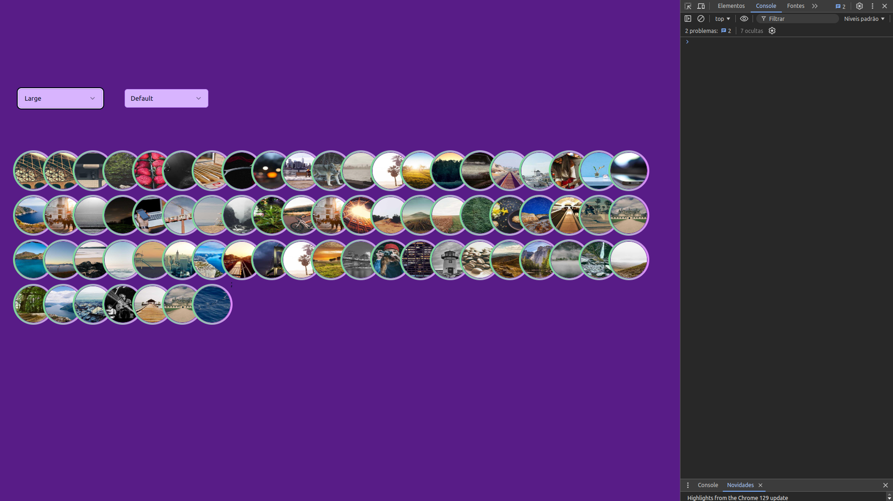

# 👥 Mini Aplicativo de Criação de Lista de Avatares
Este é um mini-aplicativo que cria uma lista de avatares utilizando **Next.js**, **React**, **TailwindCSS** e **Shadcn/ui**.

<h1 align="center">
    
</h1>

## 🚀 Motivação e Objetivo

A motivação para este projeto foi explorar tecnologias com as quais eu tinha pouca experiência. O projeto é inspirado em um mini-projeto do canal **Codante**, onde utilizei a biblioteca **Shadcn** para criar uma interface simples e dinâmica de lista de avatares, ao mesmo tempo que aprofundei meus conhecimentos em **React** e **TailwindCSS**.

## 🛠️ Pré-requisitos

Antes de iniciar, é necessário que você tenha o **Node.js** e o **npm** instalados em sua máquina. Caso ainda não os tenha, pode baixá-los [aqui](https://nodejs.org).

## 📦 Instalação

Para rodar o projeto localmente, siga os passos abaixo:

1. Clone o repositório para sua máquina:

```bash
git clone https://github.com/Tiago-Silva/avatarlist.git
```

2. Instale as dependências:

```bash
npm install
```
ou, se preferir:

```bash
yarn install
```

3. Execute o projeto em modo de desenvolvimento:

```bash
yarn dev
```

## 🌟 Tecnologias Utilizadas

As principais tecnologias e ferramentas usadas no desenvolvimento deste projeto são:

<p align="center">
  <a href="https://skillicons.dev">
    
  </a>
</p>

## 🏅 Créditos

Este projeto foi baseado em um mini-projeto do canal **Codante**. Se quiser aprender mais sobre o processo, confira os links abaixo:

- 🌐 [Site oficial da Codante](https://codante.io/mini-projetos)
- 📹 [Vídeo tutorial no YouTube](https://www.youtube.com/watch?v=5R4iC0hDVbE&list=PLuUJQI_I3K5A1jaqht32PUYpQtck0BAdL&index=7)

## 📝 Licença

Este projeto está licenciado sob a licença **MIT**. Consulte o arquivo [`LICENSE`](./LICENSE) para mais detalhes.
